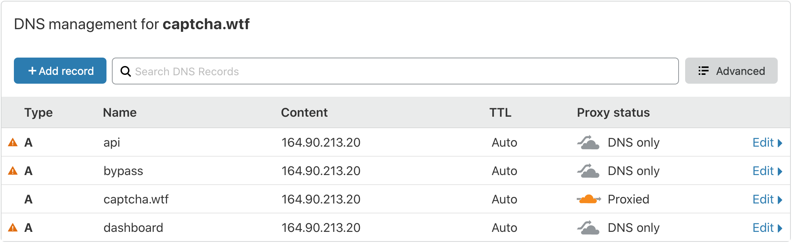
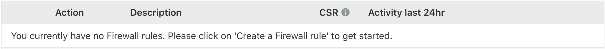
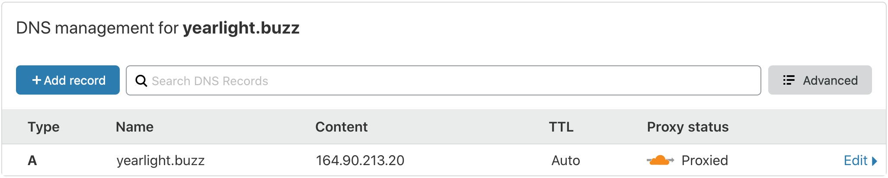
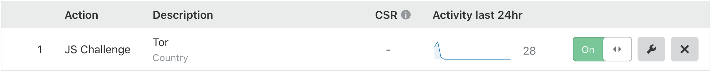
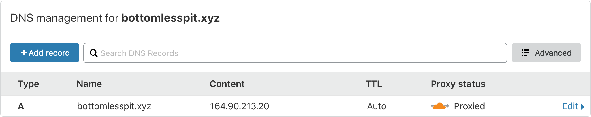
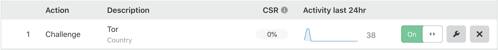
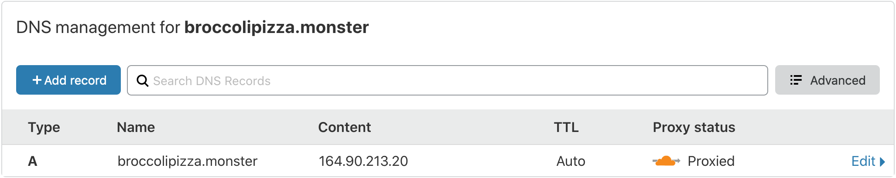
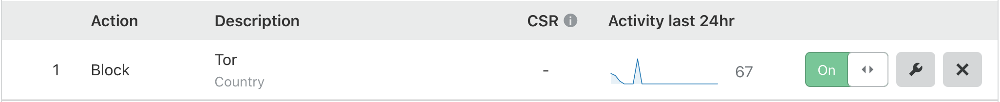
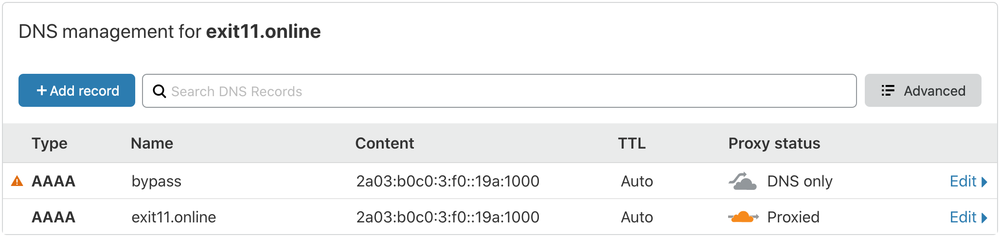
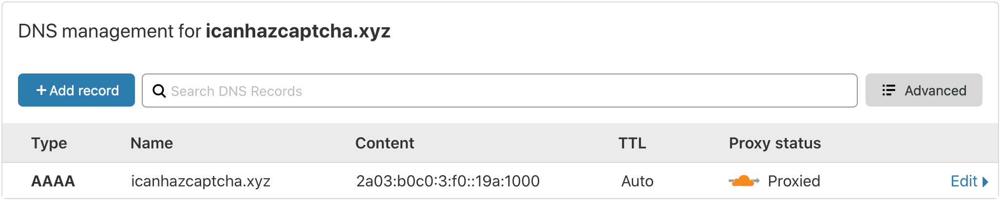

# CAPTCHA Monitor's Web Component

The files in this repository are the files used during the measurements.

`index.html` is the file that is located at `<domain>/index.html` and it is used 
for the measurements where a simple page that requires a single HTTP 
request to fetch. It is a simple "Hello World!" page.

`complex.html` is the file that is located at `<domain>/complex.html` and it is 
used for measurements where a complex page that requires multiple HTTP requests 
to fetch. This page also contains external links to widely used Bootstrap and 
jQuery libraries. Additionally, `complex.html` has a few images. `complex.html` 
tries to simulate an ordinary web page that can be found on the internet.

`captchamonitor.conf` is the configuration file used to configure the Nginx server.

Feel free to create an issue if you have any suggestions.

## Cloudflare configurations of the domains used for testing
### captcha.wtf

### yearlight.buzz

### bottomlesspit.xyz

### broccolipizza.monster

### exit11.online

### icanhazcaptcha.xyz

## Installation
1. Install Nginx
2. Copy `captchamonitor.conf` into `/etc/nginx/sites-available`
3. `ln -s /etc/nginx/sites-available/captchamonitor.conf /etc/nginx/sites-enabled/`
4. Use `nginx -t` to confirm that the configuration file is working
5. `systemctl restart nginx`
6. Add Certbot PPA via `add-apt-repository ppa:certbot/certbot && apt-get update`
7. Install Cerbot for Nginx via `apt-get install certbot python3-certbot-nginx`
8. Run `certbot --nginx`
9. Add SSL certificates to `bypass.captcha.wtf`, `bypass.exit11.online`, 
`dashboard.captcha.wtf`, and `api.captcha.wtf`
10. Choose "No redirect" when asked to redirect redirect HTTP traffic to HTTPS

See https://gitlab.torproject.org/woswos/CAPTCHA-Monitor/-/wikis/home for the 
main project and further details.