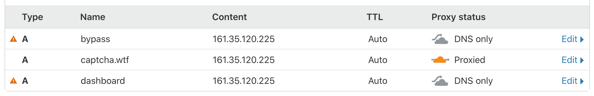
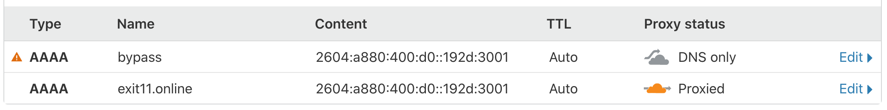

# CAPTCHA Monitor's Web Component

The files in this repository are the files used during the measurements.

`index.html` is the file that is located at [https://captcha.wtf](https://captcha.wtf)
and [https://exit11.online](https://exit11.online). `index.html` is used for the 
measurements where a simple page that requires a single HTTP request to fetch. 
It is a simple "Hello World!" example.

`complex.html` is the file that is located at 
[https://captcha.wtf/complex.html](https://captcha.wtf/complex.html)
and [https://exit11.online/complex.html](https://exit11.online/complex.html).
`complex.html` is used for measurements
where a complex page that requires multiple HTTP requests to fetch. This page
also contains external links to widely used Bootstrap and jQuery libraries.
Additionally, `complex.html` has a few images. `complex.html` tries to
simulate an ordinary web page that can be found on the internet.

`captchamonitor.conf` is the configuration file used to configure the Nginx server.

Feel free to create an issue if you have any suggestions.

_Note:_ Both [https://captcha.wtf](https://captcha.wtf) and [https://exit11.online](https://exit11.online)
are the fronted by Cloudflare. [https://bypass.captcha.wtf](https://bypass.captcha.wtf)
and [https://bypass.exit11.online](https://bypass.exit11.online) are not proxied by
Cloudflare. See the screenshots below:

## Installation
1. Install Nginx
2. Copy `captchamonitor.conf` into `/etc/nginx/sites-available`
3. `ln -s /etc/nginx/sites-available/captchamonitor.conf /etc/nginx/sites-enabled/`
4. Use `nginx -t` to confirm that the configuration file is working
5. `systemctl restart nginx`
6. Add Certbot PPA via `add-apt-repository ppa:certbot/certbot && apt-get update`
7. Install Cerbot for Nginx via `apt-get install certbot python3-certbot-nginx`
8. Run `certbot --nginx`
9. Add SSL certificates to `bypass.captcha.wtf`, `bypass.exit11.online`, and 
`dashboard.captcha.wtf`
10. Choose "No redirect" when asked to redirect redirect HTTP traffic to HTTPS

See https://gitlab.torproject.org/woswos/CAPTCHA-Monitor/-/wikis/home for the 
main project and further details.